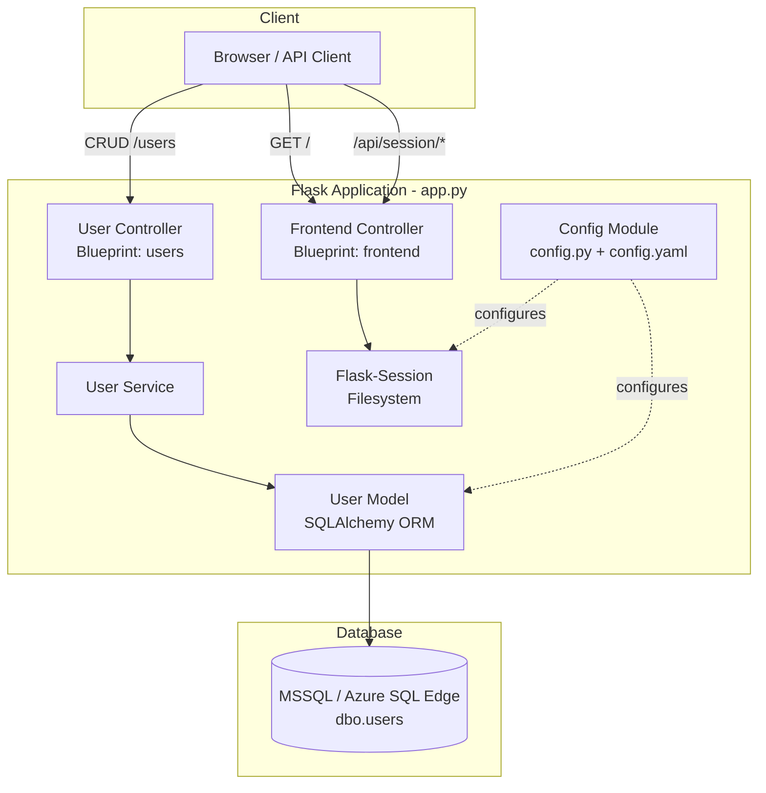
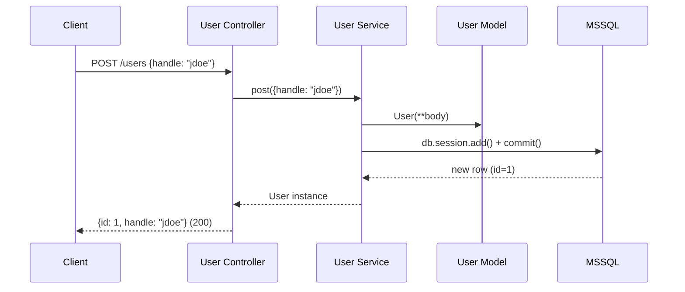
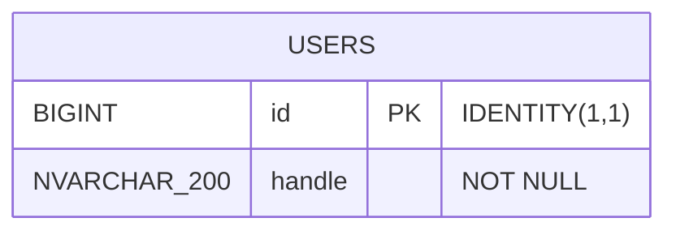

# Design Document: Hybrid Cloud App POC

## Overview

This design documents the architecture and implementation of the Hybrid Cloud App POC — a Flask-based user management REST API with an MSSQL backend, a single-page vanilla JavaScript dashboard, and hybrid cloud deployment targeting Docker Compose (local) and Red Hat OpenShift (ROSA on AWS + on-premises).

The system follows a Controller → Service → Model layered architecture using Flask Blueprints. It supports profile-based database configuration (`local`, `test`, `production`), containerized orchestration via Docker Compose for local development, and full OpenShift deployment with BuildConfig, Deployment, Service, Route, ConfigMap, HPA, and a dedicated IngressController. A k6 load testing infrastructure with InfluxDB and Grafana provides performance monitoring.

### Key Design Decisions

1. **Flask Blueprints for modularity**: Separates user API routes (`User_Controller`) from frontend/session routes (`Frontend_Controller`), enabling independent evolution.
2. **Native SQL for updates**: The `put` operation in `User_Service` uses raw SQL (`sqlalchemy.text`) to guarantee precise control over the UPDATE statement, preventing accidental `id` column overwrites.
3. **Profile-based configuration**: A single `config.py` module handles all environments via the `PROFILE` env var, with `config.yaml` providing production defaults and env var overrides.
4. **Azure SQL Edge**: Used as the MSSQL-compatible database for both local Docker and in-cluster OpenShift deployments, avoiding the need for a full SQL Server license.
5. **Filesystem-based sessions**: Flask-Session with filesystem storage keeps session state server-local, suitable for the POC scope without requiring Redis or a shared session store.
6. **Dual OpenShift targets**: Separate manifest directories (`oc/fix/` for ROSA, `oc/onprem/` for on-premises) allow deployment to both cloud and private infrastructure with different image registries and security contexts.

## Architecture

### High-Level Architecture



### Request Flow



### Deployment Architecture

```mermaid
graph TB
    subgraph "Local Development"
        DC[docker-compose.yml]
        AppLocal[app container<br/>port 8081 to 5000<br/>PROFILE=local]
        DBLocal[Azure SQL Edge<br/>port 1433]
        DC --> AppLocal
        DC --> DBLocal
        AppLocal -->|app-network| DBLocal
    end

    subgraph "ROSA on AWS - oc/fix/"
        IGC[IngressController<br/>hybrid-cloud-ingress<br/>AWS NLB Internal]
        Route[Route: app-route<br/>edge TLS]
        SvcApp[Service: app-service<br/>ClusterIP:5000]
        DeployApp[Deployment: python-app<br/>100m-200m CPU<br/>128Mi-256Mi RAM]
        HPA[HPA: 1-5 replicas<br/>CPU target 70%]
        CM[ConfigMap: app-config<br/>PROFILE=test]
        BC[BuildConfig: app-build<br/>Git to ImageStream]
        DeployDB[Deployment: database<br/>Azure SQL Edge]
        SvcDB[Service: database<br/>ClusterIP:1433]

        IGC --> Route --> SvcApp --> DeployApp
        HPA -.-> DeployApp
        CM -.-> DeployApp
        BC -.-> DeployApp
        DeployApp -->|database:1433| SvcDB --> DeployDB
    end

    subgraph "On-Premises OpenShift - oc/onprem/"
        RouteOP[Route: app-route<br/>edge TLS]
        SvcAppOP[Service: app-service]
        DeployAppOP[Deployment: python-app<br/>Harbor registry]
        HPAOP[HPA: 1-5 replicas<br/>CPU target 50%]
        DeployDBOP[Deployment: database<br/>Harbor registry<br/>runAsNonRoot]
        SvcDBOP[Service: database]

        RouteOP --> SvcAppOP --> DeployAppOP
        HPAOP -.-> DeployAppOP
        DeployAppOP --> SvcDBOP --> DeployDBOP
    end

    subgraph "Load Testing - load-test/"
        K6[k6 test runner]
        InfluxDB[InfluxDB 1.8]
        Grafana[Grafana<br/>port 3000]
        K6 -->|metrics| InfluxDB
        Grafana -->|query| InfluxDB
    end
```



## Components and Interfaces

### 1. Config Module (`app/config.py`)

Initializes the Flask application, SQLAlchemy, Flask-Migrate, and Flask-Session. Handles profile-based database configuration.

**Interfaces:**

- Exports: `app` (Flask instance), `db` (SQLAlchemy instance), `migrate` (Migrate instance)
- Reads: `config.yaml` for production database URI/password defaults
- Environment variables: `PROFILE` / `APP_PROFILE`, `SQLALCHEMY_DATABASE_URI`, `DATABASE_URI`, `DATABASE_PASSWORD`, `SECRET_KEY`

**Profile Resolution Logic:**

1. If `SQLALCHEMY_DATABASE_URI` env var is set → use directly (no password substitution)
2. Else resolve profile from `PROFILE` or `APP_PROFILE` env var (default: `production`)
3. `local` / `test` → hardcoded connection to `database:1433/master` with ODBC Driver 18
4. `production` → read from `config.yaml`, with env var overrides for `DATABASE_URI` and `DATABASE_PASSWORD`
5. Password is URL-encoded via `urllib.parse.quote_plus` before substitution into the URI template

**Session Configuration:**

- Type: `filesystem`
- Directory: `{tempdir}/flask_session`
- File threshold: 200
- Lifetime: 1800 seconds (30 minutes)

### 2. Application Entry Point (`app/app.py`)

Registers Blueprints, initializes Flask-Session, runs database initialization with retry logic, and starts the Flask development server.

**Interfaces:**

- Registers: `User_Controller` blueprint (prefix-less), `Frontend_Controller` blueprint (prefix-less)
- Calls: `init_database()` on startup
- Runs: `app.run(host='0.0.0.0', port=5000)`

**Database Initialization:**

- Calls `db.create_all()` within app context
- Retries up to 10 times with 5-second delays on failure
- Logs warning and continues if all attempts fail

### 3. User Controller (`app/controllers/user_controller.py`)

Flask Blueprint handling HTTP routing for user CRUD operations.

**API Contract:**

| Method | Endpoint | Request Body | Response | Status |
|--------|----------|-------------|----------|--------|
| GET | `/users?page=&limit=` | — | `{users: [...], meta: {page, limit, total, pages}}` | 200 |
| GET | `/users/<id>` | — | `{id, handle}` | 200 |
| POST | `/users` | `{handle}` | `{id, handle}` | 200 |
| PUT | `/users/<id>` | `{handle}` | `{id, handle}` | 200 |
| DELETE | `/users/<id>` | — | `{success: true}` | 200 |

**Error Handling:**

- Registers a Blueprint-level `errorhandler(HTTPException)` that returns JSON: `{success: false, message: <description>}` with `content-type: application/json`
- Invalid `page`/`limit` query params default to `page=1, limit=100`

### 4. Frontend Controller (`app/controllers/frontend_controller.py`)

Flask Blueprint serving the dashboard UI and session management endpoints.

**API Contract:**

| Method | Endpoint | Request Body | Response |
|--------|----------|-------------|----------|
| GET | `/` | — | Renders `index.html` |
| GET | `/api/session/users` | — | `{users: [...]}` |
| POST | `/api/session/users` | `{users: [...]}` | `{success: true, message: "Session updated"}` |
| POST | `/api/session/clear` | — | `{success: true, message: "Session cleared"}` |

### 5. User Service (`app/services/user_service.py`)

Business logic layer for User CRUD operations.

**Interfaces:**

| Function | Parameters | Returns | Raises |
|----------|-----------|---------|--------|
| `get(page, limit)` | page: int (default 1), limit: int (default 100) | dict with `data`, `total`, `page`, `limit`, `pages` | — |
| `get_by_id(id)` | id: any | User instance | `NotFound` if not found |
| `post(body)` | body: dict | User instance | — |
| `put(id, body)` | id: any, body: dict | User instance | `NotFound` if not found or invalid ID |
| `delete(id)` | id: any | `{success: true}` | `NotFound` if not found |

**Key Behaviors:**

- `get()`: Orders by `id` ascending, uses offset/limit pagination, computes `pages` via ceiling division
- `put()`: Validates `id` as integer, filters out `id` from body, uses native SQL UPDATE via `sqlalchemy.text`, returns existing user unchanged if body is empty after filtering
- `delete()`: Fetches user first, then deletes via ORM

### 6. User Model (`app/models/user.py`)

SQLAlchemy ORM model mapping to `dbo.users`.

**Schema:**

- Table: `dbo.users`
- `id`: `BigInteger`, primary key, auto-increment
- `handle`: `String(200)`, not null

**Methods:**

- `as_dict()`: Returns a dictionary of all column values using column introspection

### 7. Dashboard UI (`app/templates/index.html`)

Single-page vanilla JavaScript application for user management.

**Features:**

- Create/Update form with User ID (read-only) and Handle (required) fields
- User card list with Edit and Delete action buttons
- Pagination with Previous/Next buttons and page/total display
- Alert messages (success/error) that auto-dismiss after 5 seconds
- Responsive grid layout (2-column on desktop, 1-column on mobile)
- Calls REST API endpoints directly (same origin)

### 8. Database Initialization (`db/init-scripts/init.sql`)

SQL script executed during database container startup.

**Operations:**

1. Creates `hybrid_usr` database if not exists
2. Switches to `hybrid_usr` context
3. Creates `dbo.users` table (BIGINT IDENTITY PK, NVARCHAR(200) handle) if not exists
4. Seeds `jdoe_99` and `tech_wiz` handles if not already present

### 9. Docker Compose Stack (`docker-compose.yml`)

Local development orchestration.

**Services:**

- `app`: Builds from `app/Containerfile`, maps 8081 to 5000, mounts `./app` as volume, `PROFILE=local`, depends on `database`
- `database`: Azure SQL Edge, exposes 1433, sets `MSSQL_SA_PASSWORD` and `ACCEPT_EULA`
- Network: `app-network` (bridge driver)

### 10. OpenShift Manifests — ROSA (`oc/fix/`)

**Resources:**

- `BuildConfig` (`app-build`): Builds from Git repo, Containerfile strategy, outputs to `app:latest` ImageStream
- `Deployment` (`python-app`): Internal registry image, 100m-200m CPU, 128Mi-256Mi RAM, readiness/liveness probes on `/` port 5000, envFrom ConfigMap, rolling update strategy
- `Service` (`app-service`): ClusterIP, port 5000
- `Route` (`app-route`): Edge TLS termination with DigiCert certificate, host `uat-hybridcloud.krungsri.com`
- `ConfigMap` (`app-config`): `PROFILE=test`, `FLASK_APP=app.app`
- `Deployment` (`database`): Azure SQL Edge, port 1433, runAsUser 0, readiness probe on TCP 1433
- `Service` (`database`): ClusterIP, port 1433
- `HPA` (`python-app-hpa`): 1-5 replicas, CPU target 70%
- `IngressController` (`hybrid-cloud-ingress`): Internal AWS NLB, namespace selector `ks-hybrid-cloud-poc`, TLS 1.2 minimum, 2 replicas

### 11. OpenShift Manifests — On-Premises (`oc/onprem/`)

**Differences from ROSA:**

- Images pulled from `harbor.krungsri.net/kscloud/` private registry
- `imagePullSecrets: harbor-pull-secret` on all Deployments
- Database Deployment: `runAsNonRoot: true`, dropped capabilities (`ALL`), added `NET_BIND_SERVICE`
- HPA CPU target: 50% (vs 70% on ROSA)
- Namespace: `rosa-poc` (vs `ks-hybrid-cloud-poc`)
- No BuildConfig or IngressController (images pre-built and pushed to Harbor)

### 12. Load Testing Infrastructure (`load-test/`)

**Components:**

- `load_test.js`: k6 script with two scenarios:
  - `functional_api`: Single VU, 1 iteration — POST, GET, PUT, DELETE happy path
  - `load_test`: Constant arrival rate (10 req/s), 1 minute, up to 100 VUs
- Thresholds: less than 1% errors, p95 latency under 2000ms
- Custom metrics: `errors` (Rate), `api_latency` (Trend)
- Docker Compose: k6, InfluxDB 1.8, Grafana with provisioned datasource and pre-built dashboard

## Data Models

### User Entity



**SQLAlchemy Mapping:**

```python
class User(db.Model):
    __tablename__ = 'users'
    __table_args__ = {'schema': 'dbo'}
    id = db.Column(db.BigInteger(), primary_key=True, autoincrement=True)
    handle = db.Column(db.String(200), nullable=False)
```

**Serialization:**

- `as_dict()` returns `{id: int, handle: str}` via column introspection

### Session Data

Server-side filesystem session stores:

- `users`: List of user dictionaries (set via `/api/session/users` POST)
- Standard Flask session metadata (session ID, expiry)

### Pagination Response Schema

```json
{
  "users": [{"id": 1, "handle": "jdoe_99"}],
  "meta": {
    "page": 1,
    "limit": 100,
    "total": 42,
    "pages": 1
  }
}
```

### Configuration Schema (`config.yaml`)

```yaml
DATABASE_URI: 'mssql+pyodbc://hybrid_usr:%s@host:port/db?driver=ODBC+Driver+18+for+SQL+Server&Encrypt=yes&TrustServerCertificate=yes'
DATABASE_PASSWORD: 'password'
```

## Correctness Properties

*A property is a characteristic or behavior that should hold true across all valid executions of a system — essentially, a formal statement about what the system should do. Properties serve as the bridge between human-readable specifications and machine-verifiable correctness guarantees.*

### Property 1: User create-read round trip

*For any* valid handle string (non-empty, up to 200 characters), creating a user via `post({handle})` and then retrieving it via `get_by_id(id)` should return a user with the same `handle` value and a positive integer `id`, and the POST response itself should contain both `id` and `handle` fields.

**Validates: Requirements 1.1, 1.2, 3.1**

### Property 2: Pagination response correctness

*For any* set of users in the database and any valid `page` (>= 1) and `limit` (>= 1) values, the `get(page, limit)` function should return users ordered by `id` ascending, with at most `limit` results, and the `pages` field should equal the ceiling of `total / limit`. Each consecutive pair of users in the result should satisfy `user[i].id < user[i+1].id`.

**Validates: Requirements 2.1, 2.3**

### Property 3: Invalid pagination parameters default correctly

*For any* non-integer string values provided as `page` or `limit` query parameters, the User_Controller should default to `page=1` and `limit=100` in the response meta.

**Validates: Requirements 2.2**

### Property 4: Update round trip with id safety

*For any* existing user and *any* update body (which may or may not contain an `id` field), updating via `put(id, body)` and then reading via `get_by_id(id)` should return a user whose `id` is unchanged from the original and whose `handle` matches the new value provided in the body (excluding the `id` key).

**Validates: Requirements 4.1, 4.2**

### Property 5: Delete then not found

*For any* user that has been created and then deleted via `delete(id)`, a subsequent `get_by_id(id)` call should raise a `NotFound` error.

**Validates: Requirements 5.1**

### Property 6: Error responses are well-formed JSON

*For any* operation that triggers an `HTTPException` within the User_Controller Blueprint, the response should have `content-type: application/json` and contain a JSON body with `success: false` and a non-empty `message` string field.

**Validates: Requirements 6.1, 6.2**

### Property 7: Session store-retrieve round trip

*For any* list of user dictionaries, storing it via POST to `/api/session/users` and then retrieving via GET `/api/session/users` should return the same list.

**Validates: Requirements 7.10**

### Property 8: Profile-based database URI resolution

*For any* profile value in `{local, test, production}`, the Config_Module should produce a valid `SQLALCHEMY_DATABASE_URI` that contains `database:1433/master` for `local`/`test` profiles, and reads from `config.yaml` for the `production` profile.

**Validates: Requirements 8.1, 9.1**

### Property 9: Password URL encoding in connection string

*For any* password string containing special characters (e.g., `@`, `#`, `%`, `&`, `+`, spaces), the Config_Module should URL-encode the password via `quote_plus` before substituting it into the database URI, such that `urllib.parse.unquote_plus(encoded_password)` recovers the original password.

**Validates: Requirements 9.3**

## Error Handling

### API Layer (User Controller)

- **Blueprint-level error handler**: All `HTTPException` instances within the `users` Blueprint are caught and returned as JSON `{success: false, message: <description>}` with the appropriate HTTP status code and `application/json` content type.
- **Invalid pagination params**: `ValueError` on `int()` conversion of `page`/`limit` is caught silently, defaulting to `page=1, limit=100`.

### Service Layer (User Service)

- **Entity not found**: `get_by_id()`, `put()`, and `delete()` raise `werkzeug.exceptions.NotFound` with descriptive messages when the target user does not exist.
- **Invalid ID format**: `put()` catches `ValueError` when converting `id` to `int` and raises `NotFound` with `"Invalid user ID format"`.
- **Empty update body**: `put()` short-circuits and returns the existing user without executing SQL when the body is empty after filtering out `id`.

### Database Initialization

- **Retry with backoff**: `init_database()` in `app.py` retries `db.create_all()` up to 10 times with 5-second delays, handling container startup ordering issues.
- **Graceful degradation**: If all retries fail, the application logs a warning and continues starting (tables may already exist or require manual setup).

### Session Management

- **Missing session data**: `GET /api/session/users` defaults to an empty array `[]` when no session data exists.
- **Session clear**: `POST /api/session/clear` calls `session.clear()` and returns a success response regardless of prior session state.

## Testing Strategy

### Unit Tests

Unit tests should cover specific examples, edge cases, and error conditions:

- **Edge cases from requirements:**
  - GET `/users/<id>` with non-existent ID returns 404 with correct message (Req 3.2)
  - PUT with non-existent ID returns 404 (Req 4.3)
  - PUT with empty body (only `id` field) returns user unchanged (Req 4.4)
  - PUT with non-integer ID returns "Invalid user ID format" error (Req 4.5)
  - DELETE with non-existent ID returns 404 with correct message (Req 5.2)
  - GET `/api/session/users` with no prior session returns empty array (Req 7.11)
  - POST `/api/session/clear` clears session data (Req 7.12)

- **Configuration examples:**
  - `SQLALCHEMY_DATABASE_URI` env var overrides profile-based config (Req 8.2)
  - Production profile reads from `config.yaml` with env var overrides (Req 9.2)
  - Flask-Session config values: filesystem type, threshold 200, lifetime 1800 (Req 7.13)

- **Database initialization:**
  - `init_database()` calls `db.create_all()` (Req 10.1)
  - Retry logic attempts up to 10 times on failure (Req 10.2)
  - Application continues after all retries fail (Req 10.3)

- **Dashboard rendering:**
  - GET `/` returns HTML containing "User Management Dashboard" (Req 7.1)
  - HTML contains form with userId (read-only) and userHandle (required) fields (Req 7.2)

- **SQL script idempotency:**
  - `init.sql` creates table only if not exists (Req 11.5)
  - `init.sql` seeds data only if handles don't already exist (Req 11.6)

### Property-Based Tests

Property-based tests validate universal properties across randomly generated inputs. Use **hypothesis** as the PBT library for Python.

Each property test must:

- Run a minimum of 100 iterations (`@settings(max_examples=100)`)
- Reference the design document property via a tag comment
- Use `hypothesis.given()` with appropriate strategies for input generation
- Be implemented as a single property-based test per correctness property

**Property test implementations:**

1. **Feature: hybrid-cloud-app-poc, Property 1: User create-read round trip**
   - Strategy: `st.text(min_size=1, max_size=200, alphabet=st.characters(whitelist_categories=('L', 'N', 'P')))`
   - Test: Create user with generated handle, read back by returned ID, assert handle matches

2. **Feature: hybrid-cloud-app-poc, Property 2: Pagination response correctness**
   - Strategy: Generate a list of users, then random `page` (1-10) and `limit` (1-50)
   - Test: Call `get(page, limit)`, verify ordering (ids ascending), result count <= limit, pages == ceil(total/limit)

3. **Feature: hybrid-cloud-app-poc, Property 3: Invalid pagination parameters default correctly**
   - Strategy: `st.text()` for page and limit values that are not valid integers
   - Test: Send GET `/users?page=<text>&limit=<text>`, verify meta shows page=1, limit=100

4. **Feature: hybrid-cloud-app-poc, Property 4: Update round trip with id safety**
   - Strategy: Create a user with random handle, generate a new random handle, optionally include `id` in body
   - Test: PUT with new handle (and possibly `id` in body), GET by original ID, assert handle updated and id unchanged

5. **Feature: hybrid-cloud-app-poc, Property 5: Delete then not found**
   - Strategy: Create a user with random handle
   - Test: Delete the user, then GET by ID, assert NotFound is raised

6. **Feature: hybrid-cloud-app-poc, Property 6: Error responses are well-formed JSON**
   - Strategy: Generate random non-existent IDs (large integers)
   - Test: GET `/users/<non_existent_id>`, verify response has content-type application/json, body has success=false and message string

7. **Feature: hybrid-cloud-app-poc, Property 7: Session store-retrieve round trip**
   - Strategy: `st.lists(st.fixed_dictionaries({'id': st.integers(), 'handle': st.text(min_size=1)}))`
   - Test: POST to `/api/session/users`, GET from `/api/session/users`, assert lists match

8. **Feature: hybrid-cloud-app-poc, Property 8: Profile-based database URI resolution**
   - Strategy: `st.sampled_from(['local', 'test'])`
   - Test: Set PROFILE env var, reload config, assert URI contains `database:1433/master`

9. **Feature: hybrid-cloud-app-poc, Property 9: Password URL encoding in connection string**
   - Strategy: `st.text(min_size=1, alphabet=st.characters(whitelist_categories=('L', 'N', 'P', 'S')))`
   - Test: Encode password with `quote_plus`, decode with `unquote_plus`, assert round trip equality
